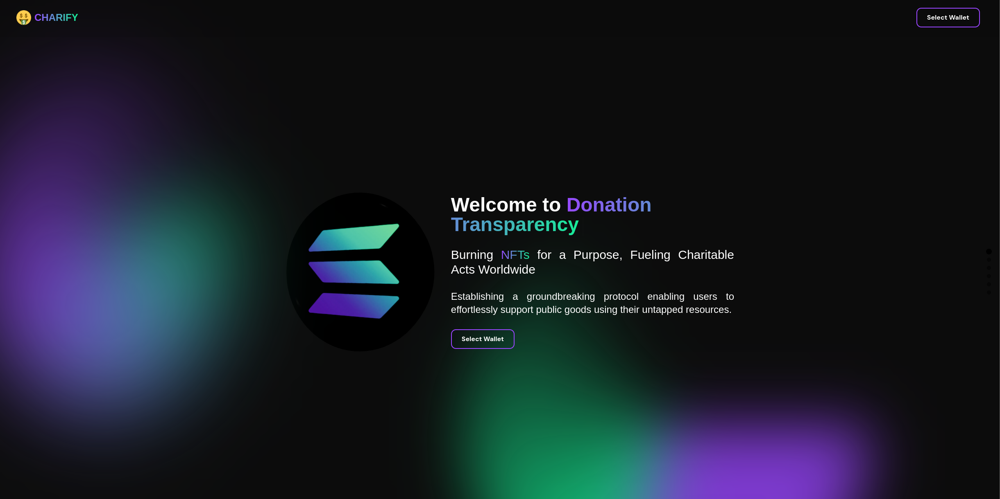

# Charify - Empowering Charitable Donations with Voting Power and Circulating Funds - [Try Me Out](https://charify.vercel.app/)

## Introduction to Charify $$

Welcome to Charify, an innovative Solana-based protocol that aims to reshape the space of charitable donations and empower voting power through funds from NFT burnings. In this comprehensive README, we'll dive deep into the core concept of Charify, its mission, problem statement, innovative solutions, value propositions, roadmap, and how it intends to revolutionize the crypto space.

#### Disclaimer

Burning your assets through Charify is not only secure but also financially beneficial. When you burn assets, such as NFTs or unused serum accounts, you're essentially cleaning up the Solana blockchain. This process reclaims vacant accounts, and in return, you receive 0.002 SOL per empty token account closed. It's a safe and rewarding way to keep the blockchain tidy while earning Solana.

## Project Description 🌟

### Problem Statement 🗂️

#### 1. Accumulation of Scam NFTs and Tokens 🗃️

The Solana ecosystem has seen an alarming proliferation of low-value and scam NFTs and tokens, eroding trust and tarnishing its reputation. These unwanted assets clutter wallets, leaving users vulnerable to potential losses, and hinder the overall growth and sustainability of the Solana network.

#### 2. Lack of a Robust Donation Protocol 👏

The crypto community is enthusiastic about contributing to charitable causes. However, there is a noticeable gap – the absence of a dedicated, reliable, and automated protocol for charitable donations directly on the blockchain. Current donation methods often rely on the efforts of influential figures in the crypto space, resulting in inconsistent and fragmented charitable acts (eg. Ukraine War Donation only lasted for a week, it could be much more consistent).

#### 3. Inconsistent Charitable Acts 💧

While there's a genuine desire within the crypto community to support charitable causes, the current methods of donation are often inconsistent. Charitable acts are typically driven by ad-hoc social media campaigns or influencer endorsements. This lack of an automated and systematic approach leads to sporadic inflows for charities, making it challenging for them to plan and execute their missions effectively.

### Solution ⚙️

#### 1. Burning Mechanism 🔥

Charify introduces a groundbreaking burning mechanism that empowers users to permanently destroy unwanted NFTs and tokens. This mechanism serves a dual purpose:

- **Incentivized Participation**: To encourage user participation in the disposal of unwanted assets, Charify rewards users with 1 $CRY token for every token address burned. Additionally, 0.002 $SOL is sent to the CharifyDAO wallet. This innovative approach leverages the blockchain's efficiency to create a win-win scenario – users clean up the blockchain, protect their wallets from potential scams, and receive rewards while contributing to charitable causes.

- **Security Enhancement**: By eliminating low-value and scam assets from circulation, Charify enhances the overall security and integrity of the Solana ecosystem. This not only safeguards users but also strengthens the blockchain itself, ensuring a safer and more reliable crypto space.

#### 2. Governance

Charify empowers $CRY token holders with the right to vote for their desired charitable cause. This democratic governance approach ensures that the crypto community actively participates in deciding what the donated funds should go for. The voting proposal with the most votes receives the donation for that specific purpose, ensuring transparency and fairness in the distribution of funds throughout the entire process.

#### 3. Donation

Charify's commitment to charitable donations is unwavering. Instead of relying solely on inflows from the crypto community, Charify utilizes funds generated from the closure of NFT burned accounts. This strategic choice aligns with Charify's mission to maximize the impact of every contribution. By utilizing the burn funds, Charify ensures that every token burned translates directly into charitable support for best causs, creating a seamless connection between cleaning up the blockchain and making a real difference in the lives of those in need. It's a synergy that embodies Charify's ethos of efficiency and compassion.

#### 4. Sustainable Revenue Model

To ensure the long-term sustainability of Charify, 10% of CharifyDAO wallet's funds are allocated as a motivation token to support further project development. This revenue model ensures that Charify can continue to innovate and make a lasting impact on the crypto community.

### Value Proposition 🔥

Charify offers a range of compelling value propositions:

- **Incentivized Participation**: Charify rewards users for participating in the burning mechanism, creating a win-win situation where users enhance their security while contributing to the overall health of the ecosystem.

- **Effortless Charitable Donations**: Charify streamlines the process of donating to charities on Solana, maximizing the chain's lightning fast transaction speed and dirt cheap gas fees. It makes charitable acts consistent and straightforward, ensuring that funds flow steadily to causes that need them most hastily.

- **Community-Driven Governance**: $CRY token holders have a real say in the direction of charitable donations. This democratic approach empowers the crypto community to support causes that resonate with them, strengthening trust and transparency.

- **Enhanced Security**: The burning mechanism is not just a means to dispose of unwanted assets; it's a security-enhancing tool. By eliminating low-value and scam NFTs and tokens, Charify improves the overall quality of the Solana ecosystem.

### User Interface

- **Landing Page**: A visually appealing landing page will introduce the Charify Protocol, providing users with a clear understanding of its mission and functionalities.
- landingpage.png

- **Burning Page**: The dashboard provides a user-friendly interface displaying users' NFTs on Solana, allowing them to select which NFTs to burn. This burning process, on the "Burning Page," incentivizes users with 1 $CRY token for every token burned, and 0.002 $SOL gets sent to CharifyDAO for charitable donations later on.
- burningpage.png

- **Governance**: Charify extends beyond burning mechanisms; it's a platform for community-driven governance. $CRY token holders vote for preferred charitable causes, ensuring active participation in allocating donated funds for the best purposes. Proposals with the most votes receive donations, ensuring transparency and fairness.
- governance.png

## Roadmap 🚀

Charify's roadmap outlines its strategic approach to making the crypto space more charitable and secure:

- **Utilizing Phantom Burning Mechanism / Sol Incinerator**: Charify plans to utilize Sol Incinerator for the burn mechanism, enhancing security and ensuring the legitimacy of burned tokens for a more streamlined burning process.

- **Building a Community**: Social channels will be set up to foster community engagement and encourage participation in charitable acts, keeping the donation train going at all times.

- **Implementing a Donation Epoch**: Charify will implement a 30-day Epoch for Donation Transactions, ensuring that charitable donations are made regularly and consistently.

## Building Blocks 🏗️

To achieve its ambitious goals, Charify will need to develop several key components:

### Tech Stack ⚙️

Charify leverages the following technologies and tools:

- **Package Manager**: `yarn`

- **Smart Contract Development**: `solidity`, `solang`, `anchor`

- **Deploy**: `anchor deploy`

- **SDK**: `openzeppelin`, `sqds`

- **Network**: `solana-devnet`

- **Frontend**: `next`, `react`

- **Contract Interactions**: `thirdwebsdk`

- **Styling**: `tailwindcss`

- **Linting & Formatting**: `eslint`, `prettier`

- **Design**: `eraser.io`

- **Misc**:

### Smart Contracts

- **$CRY Token Development**: The $CRY token will be developed on Devnet, creating the backbone of the Charify ecosystem.

- **Burning Mechanism**: The burning mechanism will be implemented, possibly using Sol Incinerator, to ensure the secure disposal of unwanted tokens and NFTs.

- **Voting System**: A robust voting system will be created to allow $CRY token holders to participate in the governance of charitable donations.

## Explore Charify 💭

Charify invites you to explore a new era in crypto where burning assets and governance drive impactful change. Discover the essence of our project:

- **Burning for a Purpose**: At Charify, burning assets isn't just about security; it's a step towards a more compassionate crypto space. When you burn, you clean up the blockchain, and in return, you receive 0.002 SOL. Join us in making the blockchain cleaner and more efficient while contributing to charitable causes.

- **Community-Driven Governance**: Charify empowers you to have a say in charitable donations. As a $CRY token holder, you participate in governance, helping decide where our donated funds go. Your vote matters, ensuring transparency and fairness in the distribution of donations.

If you have valuable feedback, innovative ideas, or a desire to contribute to the Charify project, please don't hesitate to reach out on [GitHub](https://github.com/0xBenjamintan/charify). Together, we can shape a crypto space where compassion and purpose drive positive change.

## Bounty Track

- DeFi Bounty Track, with a mission to design new decentralized applications that foster a more open financial system. The project aims to connect users to crypto, enabling them to build projects that help everyone transact in cryptocurrency.

- Squads SDK Side Track: Utilising https://squads.so/ to create a Multisig wallet to manage CharifyDAO Funds, set up voting proposals and transfer DAO Funds securely with the functionality of a Multisig.

## Conclusion

Charify is more than just a protocol; it's a movement that aims to make charitable donations an integral part of the crypto community. By providing users with the tools they need to dispose of unwanted assets securely and vote on charitable causes, Charify is paving the way for a more compassionate and transparent crypto space. Join us in our mission to make the world a better place—one $CRY token at a time.
