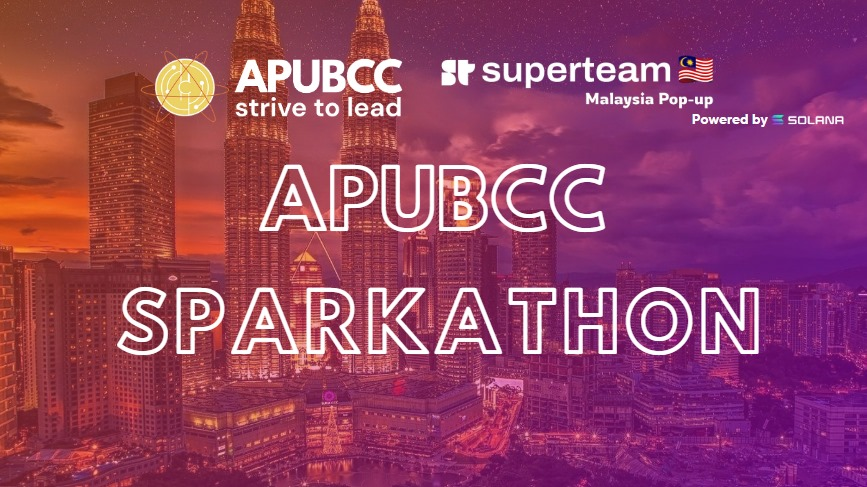

This is a [Next.js](https://nextjs.org/) project bootstrapped with [`create-next-app`](https://github.com/vercel/next.js/tree/canary/packages/create-next-app). This repo serves as a template for the APUBCC Sparkathon 2023, which allows users to build and interact with the Solana Blockchain. The template is built using Next.js, Tailwind CSS, [Solutils](https://solutils.vercel.app/), and using the [Phantom Wallet](https://phantom.app/) to connect to Solana.

Try the app here: [Click Me](https://web3-boilerplate-lyart.vercel.app/)

## Getting Started

First, create a new repo from the template. Do note that this repo is using YARN and not NPM.

Once, repo has been created run the following command to install necessary dependencies:

```bash
yarn install
```

To run the development server, use the following command:

```bash
yarn dev
```

Open [http://localhost:3000](http://localhost:3000) with your browser to see the result.

You can start editing the page by modifying `pages/index.js`. The page auto-updates as you edit the file.

[API routes](https://nextjs.org/docs/api-routes/introduction) can be accessed on [http://localhost:3000/api/hello](http://localhost:3000/api/hello). This endpoint can be edited in `pages/api/hello.js`.

The `pages/api` directory is mapped to `/api/*`. Files in this directory are treated as [API routes](https://nextjs.org/docs/api-routes/introduction) instead of React pages.

This project uses [`next/font`](https://nextjs.org/docs/basic-features/font-optimization) to automatically optimize and load Inter, a custom Google Font.

## Learn More

To learn more about Next.js, take a look at the following resources:

- [Next.js Documentation](https://nextjs.org/docs) - learn about Next.js features and API.
- [Learn Next.js](https://nextjs.org/learn) - an interactive Next.js tutorial.

You can check out [the Next.js GitHub repository](https://github.com/vercel/next.js/) - your feedback and contributions are welcome!
